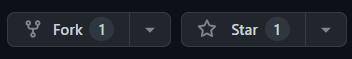

Welcome to the Gatsby Blog Template! This open-source repository provides a customizable foundation for creating your own personal or professional blog using Gatsby, a popular React-based static site generator. Contribute to this project or use it as a starting point for your blogging needs.

Author: [preetsuthar](https://preetsuthar.me) | [github](https://github.com/preetsuthar17)

 
Key Features:
--------------------------------

📝 **Markdown-based Blogging**: Write your blog posts using simple Markdown syntax, making content creation a breeze.

🎨 **Customizable Design**: Easily modify the look and feel of your blog by leveraging Gatsby's theming capabilities and CSS-in-JS approach.

🔍 **SEO-friendly**: Optimize your blog for search engines with built-in features like meta tags, sitemaps, and schema markup.

🚀 **Blazing Fast Performance**: Utilizing Gatsby's static site generation, your blog will load quickly, providing a smooth user experience.

📱 **Responsive Layout**: Your blog will be accessible and look great across various devices and screen sizes.

💬 **Comments Support**: Engage with your readers by enabling comments through popular services like Disqus or GitHub Discussions.

🔒 **Security**: Implement best practices for security, and stay up-to-date with Gatsby's security announcements.

📊 **Analytics Integration**: Integrate with various analytics services to track visitors and understand their behavior.

Contributing:
--------------------------------

We welcome contributions from developers of all skill levels. To contribute to the Gatsby Blog Template:

1. Fork the repository.
2. Create a new branch from `main`.
3. Make your changes and improvements.
4. Push changes to your fork.
5. Open a pull request (PR) to the main repository.

Getting Started:
--------------------------------

To run the Gatsby Blog Template:

1. Clone the repository.
2. Install dependencies using npm or yarn.
3. Customize configuration files and add content.
4. Preview your blog using Gatsby's development server.
5. Deploy your blog to a hosting service.

License:
--------------------------------

This project is licensed under the MIT License, allowing free use, modification, and distribution.

Join our community and share your ideas with the world using the Gatsby Blog Template! 🎉

---

Note: The above description is a fictional representation of a generic Gatsby blog template repository. To find actual open-source Gatsby blog templates, head over to GitHub and search for repositories with relevant keywords like "Gatsby blog template" or "Gatsby starter blog." Be sure to check the license and contribution guidelines of the repository you choose to use or contribute to.
